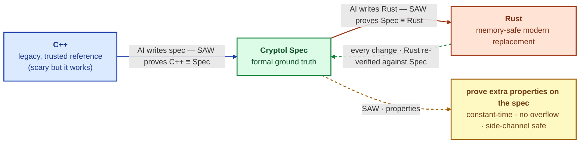

# How We Prove Code is Correct

This documentation explains how we use formal verification to validate critical behavior in SDEP (Secure Device Enrollment Protocol) implementations.

This work was developed as a class project for Computer Aided Reasoning for Software (CARS) (University of Washington), Spring 2026 as part of the Professional Masters Program.

Most engineering teams rely on testing and review for code quality. As AI-generated code becomes more and more prevalent, these tools are no longer sufficient to ensure quality. We need an automated way to prove the correctness of AI-generated code.

Formal verification is very powerful. It can prove whether a property holds for all inputs within a defined model. However, historically it has rarely been used because it is slow, difficult, and results in code that is correct for a definition of "correct" you need a PhD to parse.

This project aims to make formal verification a bit more accessible to your average engineer. I don't know about you, but when I see a statement like:

```cryptol
property P1_ActiveKeyCannotBeReactivated fleetEnabled validMetadata authResult keyAlreadyActive =
  isAuthResult authResult ==>
    keyAlreadyActive ==>
      enrollDevice fleetEnabled validMetadata authResult AC_AlreadyActive
        != ER_Succeeded
```

I get flashbacks to high school algebra and my brain nopes out. I built [cryptal-crystol](https://github.com/AmeliaRose802/pretty-specs) so that you can easily convert scary but provable specifications into friendly documentation. Since these docs are autogenerated from your proven specs in a pipeline, you never have to worry whether they have drifted away from your implementation.

Having to read and write code like:

```saw
let authenticate_equiv_spec = do {
    dateValid      <- llvm_fresh_var "dateValid"      (llvm_int 1);
    signatureValid <- llvm_fresh_var "signatureValid" (llvm_int 1);
    claimsValid    <- llvm_fresh_var "claimsValid"    (llvm_int 1);

    llvm_execute_func [llvm_term dateValid, llvm_term signatureValid, llvm_term claimsValid];

    llvm_return (llvm_term
        {{ [authenticate (dateValid ! 0) (signatureValid ! 0) (claimsValid ! 0)] : [1] }});
};

llvm_verify m "?authenticate@sdep@@YA_N_N00@Z" [] false authenticate_equiv_spec z3;
```

sends me running for the hills, so I built [saw-spec-gen](https://github.com/AmeliaRose802/saw-spec-gen) to auto-generate most of the SAW script overhead.

Demo protocol is a similar design to the Metadata Security Protocol used in Azure, based only on external public documentation. It serves as an example of how real, messy C++ code can be verified.

## C++ to Rust Equivalence

I work on converting large legacy C++ codebases to Rust. This is a hard task because C++ and Rust, though they serve the same role, are not very similar languages. What's worse, these legacy C++ components often either have no specifications or 20 years' worth of contradictory and nonsensical docs. In my line of work, the implementation is the only true specification.

Transcompiler solutions generally do not produce idiomatic, efficient, clean, and well-designed Rust, meaning that most of this reimplementation is done by hand.

Unlike mechanical transcompilers, LLMs such as Claude can produce some really nice idiomatic Rust. Unfortunately, when you are working on a security-critical component, trusting the AI's output isn't the best life choice.

It looks right, but would you trust it with your bank details?

One of the goals of this project is to bridge this gap by automatically proving Rust and C++ equivalent.



Because each arrow is a proof, equivalence chains together: **C++ ≡ Spec ≡ Rust**. You can have AI write your Rust and Cryptol without trusting it farther than you can throw it.

## Tools

- [Z3](https://github.com/Z3Prover/z3) — SMT solver that discharges the proof obligations.
- [SAW](https://saw.galois.com/) — symbolically executes compiled code and generates those obligations.
- [Cryptol](https://cryptol.net/) — language for the executable protocol specifications.
- [saw-spec-gen](https://github.com/AmeliaRose802/saw-spec-gen) — auto-generates SAW harnesses from source and specs.
- [pretty-specs](https://github.com/AmeliaRose802/pretty-specs) — turns proven Cryptol specs into documentation.
