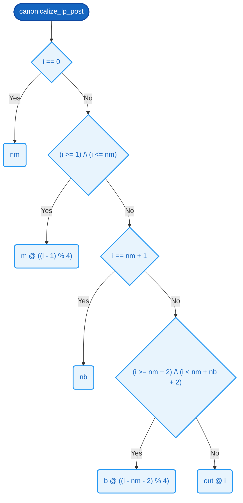

# `canonicalize_lp_post`  🧩

> 🧩 **Model abstraction.** Bounded (MAX_LEN) length-prefix encoder model; the production canonicalize_lp in cpp/src/decision.cpp is proven separately under the length bound. No production function is proven equivalent to this definition on this page.

### Signature

**Parameters**
- `out`: [10][8]
- `m`: [4][8]
- `nm`: [8]
- `b`: [4][8]
- `nb`: [8]

**Returns**
- [10][8]

<details><summary>Raw signature</summary>

`[10][8] -> [4][8] -> [8] -> [4][8] -> [8] -> [10][8]`

</details>

### Formal definition (Cryptol)

```haskell
canonicalize_lp_post out m nm b nb =
    [ byteAt i | i <- ([0 .. 9] : [10][8]) ]
  where
    byteAt : [8] -> [8]
    byteAt i =
      if  i == 0                            then nm
       | (i >= 1)      /\ (i <= nm)          then m @ ((i - 1) % 4)
       |  i == nm + 1                        then nb
       | (i >= nm + 2) /\ (i < nm + nb + 2)  then b @ ((i - nm - 2) % 4)
      else                                        out @ i
```

> **Not yet verified.**

Length-prefixed canonicalization writes

```text
    out[0]            = nm
    out[1..1+nm)      = m[0..nm)
    out[1+nm]         = nb
    out[2+nm..2+nm+nb) = b[0..nb)
```

to `out`, leaving bytes at positions >= 2+nm+nb unchanged. The SAW spec
(auto-generated under cpp/saw/out_canonicalize_lp/ via saw-spec-gen
gen-verify with --max-len-precond nm=4 / nb=4) runs at MAX_LEN = 4 —
the smallest bound that still exercises the loop induction. It composes
with [P23](../properties/canonicalization-byte-injectivity.md#p23--distinct-requests-have-distinct-canonical-bytes) (the two-field length-prefix roundtrip, [FieldLen](../types.md#fieldlen) = 4): SAW
proves the C++ writes the [nm][m][nb][b] byte layout for nm,nb <= 4,
and [P23](../properties/canonicalization-byte-injectivity.md#p23--distinct-requests-have-distinct-canonical-bytes) proves that exact layout is injective by exhibiting a decoder
that recovers (m,nm,b,nb) from the bytes — so the length tags are
load-bearing, not the field widths. Wall-clock SMT timings on
commodity hardware (Z3 4.x): MAX_LEN=4 ~ seconds (current),
MAX_LEN=8 ~ 10s, MAX_LEN=12 ~ 2 min, MAX_LEN=16 ~ 13 min. To lift the
bound entirely use `llvm_invariant`.
To change MAX_LEN: change the [N][8] / [2*N+2][8] sizes below, the
modulo constants in `byteAt`, and the matching literals in the SAW spec.
Both Cryptol fns take the C arg list verbatim — (out, m, nm, b, nb) —
so saw-spec-gen's default 1:1 mapping works with no --cryptol-arg-order
override.  `canonicalize_lp_ret` ignores the buffer args (its result
depends only on the two lengths); `canonicalize_lp_post` interprets
the incoming `out` as the *pre-state* of the buffer (i.e. the bytes
past 2+nm+nb that the C function must leave untouched).



