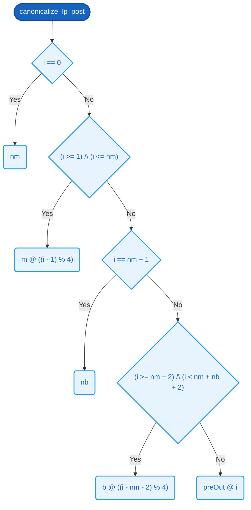

# `canonicalize_lp_post`

### Signature

**Parameters**
- `nm`: [8]
- `m`: [4][8]
- `nb`: [8]
- `b`: [4][8]
- `preOut`: [10][8]

**Returns**
- [10][8]

<details><summary>Raw signature</summary>

`[8] -> [4][8] -> [8] -> [4][8] -> [10][8] -> [10][8]`

</details>

### Formal definition (Cryptol)

```haskell
canonicalize_lp_post nm m nb b preOut =
    [ byteAt i | i <- ([0 .. 9] : [10][8]) ]
  where
    byteAt : [8] -> [8]
    byteAt i =
      if  i == 0                            then nm
       | (i >= 1)      /\ (i <= nm)          then m @ ((i - 1) % 4)
       |  i == nm + 1                        then nb
       | (i >= nm + 2) /\ (i < nm + nb + 2)  then b @ ((i - nm - 2) % 4)
      else                                        preOut @ i
```

Length-prefixed canonicalization writes

```text
    out[0]            = nm
    out[1..1+nm)      = m[0..nm)
    out[1+nm]         = nb
    out[2+nm..2+nm+nb) = b[0..nb)
```

to `out`, leaving bytes at positions >= 2+nm+nb unchanged. The SAW spec
(cpp/saw/custom/canonicalize_lp.saw) runs at MAX_LEN = 4 — the smallest
bound that still exercises the loop induction. It composes with [P24](../properties/canonicalization-byte-injectivity.md#p24--distinct-headers-have-distinct-canonical-bytes)
([FieldLen](../types.md#fieldlen) = 16) up to min(4, 16) = 4: SAW proves the C++ implements the
byte layout for nm,nb <= 4, and [P24](../properties/canonicalization-byte-injectivity.md#p24--distinct-headers-have-distinct-canonical-bytes) proves that byte layout is injective
at any [FieldLen](../types.md#fieldlen) >= 4. Wall-clock SMT timings on commodity hardware (Z3 4.x):
MAX_LEN=4 ~ seconds (current), MAX_LEN=8 ~ 10s, MAX_LEN=12 ~ 2 min,
MAX_LEN=16 ~ 13 min. To lift the bound entirely use `llvm_invariant`.
To change MAX_LEN: change the [N][8] / [2*N+2][8] sizes below, the
modulo constants in `byteAt`, and the matching literals in the SAW spec.



