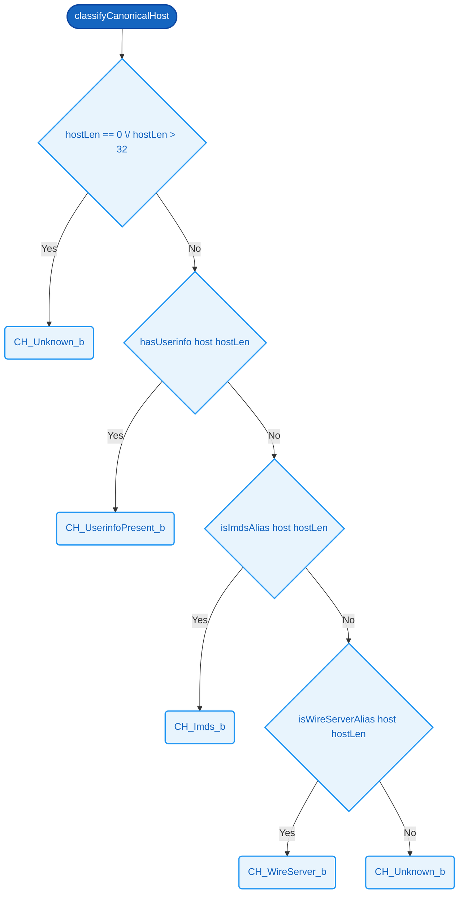

# `classifyCanonicalHost`  ⚠️

> ⚠️ **Implemented, unverified.** This function exists in the codebase but **no machine-checked equivalence proof** has been discharged. Real implementation: `C:/Users/ameliapayne/demo_protocol/cpp/include/sdep/decision.hpp`. Proof has not been attempted yet.

### Signature

**Parameters**
- `host`: [32][8]
- `hostLen`: [8]

**Returns**
- [8]

<details><summary>Raw signature</summary>

`[32][8] -> [8] -> [8]`

</details>

### Formal definition (Cryptol)

```haskell
classifyCanonicalHost host hostLen =
  if hostLen == 0 \/ hostLen > 32 then CH_Unknown_b
   | hasUserinfo host hostLen      then CH_UserinfoPresent_b
   | isImdsAlias host hostLen      then CH_Imds_b
   | isWireServerAlias host hostLen then CH_WireServer_b
  else                                  CH_Unknown_b
```

> **Not yet verified.**

Evaluates 5 conditions on `host` and `hostLen` in priority order, returning the first applicable 8 bits. Defaults to `CH_Unknown_b` when no prior condition matches.



