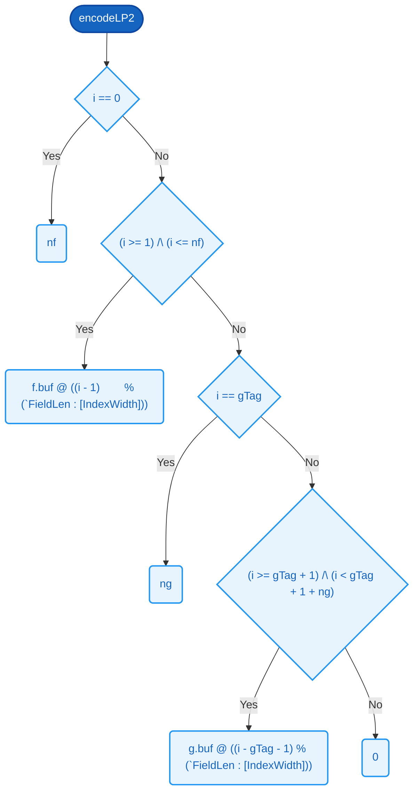

# `encodeLP2`  `internal helper`

### Signature

**Parameters**
- `f`: [LpField](../types.md#lpfield)
- `g`: [LpField](../types.md#lpfield)

**Returns**
- [2 * [FieldLen](../types.md#fieldlen) + 2][8]

<details><summary>Raw signature</summary>

`LpField -> LpField -> [2 * FieldLen + 2][8]`

</details>

### Formal definition (Cryptol)

```haskell
encodeLP2 f g =
      [ byteAt i | i <- ([0 .. 2 * FieldLen + 1] : [2 * FieldLen + 2][IndexWidth]) ]
    where
      nf   = f.len
      ng   = g.len
      gTag = nf + 1                    // position of g's length tag
      byteAt : [IndexWidth] -> [8]
      byteAt i =
        if  i == 0                                    then nf
         | (i >= 1)        /\ (i <= nf)                then f.buf @ ((i - 1)        % (`FieldLen : [IndexWidth]))
         |  i == gTag                                  then ng
         | (i >= gTag + 1) /\ (i < gTag + 1 + ng)      then g.buf @ ((i - gTag - 1) % (`FieldLen : [IndexWidth]))
        else                                                0
```

---- Two-field length-prefix encoder/decoder (top-level payload) ------
encodeLP2 writes  [f.len] f.buf[0..f.len)  [g.len] g.buf[0..g.len)
then zero-pads. The position of g's tag is f.len + 1, so the f|g
boundary is determined by the tag, not by the slot width. This is the
exact byte layout the SAW-verified `canonicalize_lp` emits.



### Related Properties
- [P23 — Distinct Requests Have Distinct Canonical Bytes](../properties/canonicalization-byte-injectivity.md#p23--distinct-requests-have-distinct-canonical-bytes)

