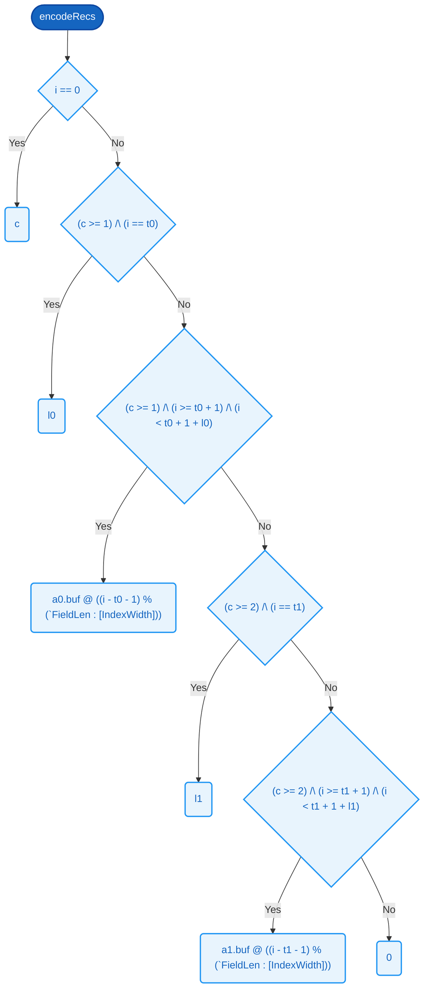

# `encodeRecs`  `internal helper`

### Signature

**Parameters**
- `c`: [[IndexWidth](../types.md#indexwidth)]
- `a0`: [LpField](../types.md#lpfield)
- `a1`: [LpField](../types.md#lpfield)

**Returns**
- [[RecBufLen](../types.md#recbuflen)][8]

<details><summary>Raw signature</summary>

`[IndexWidth] -> LpField -> LpField -> [RecBufLen][8]`

</details>

### Formal definition (Cryptol)

```haskell
encodeRecs c a0 a1 =
      [ byteAt i | i <- ([0 .. RecBufLen - 1] : [RecBufLen][IndexWidth]) ]
    where
      l0 = a0.len
      l1 = a1.len
      t0 = 1                           // item0 tag position
      t1 = 2 + l0                      // item1 tag position (immediately after item0)
      byteAt : [IndexWidth] -> [8]
      byteAt i =
        if  i == 0                                        then c
         | (c >= 1) /\ (i == t0)                          then l0
         | (c >= 1) /\ (i >= t0 + 1) /\ (i < t0 + 1 + l0) then a0.buf @ ((i - t0 - 1) % (`FieldLen : [IndexWidth]))
         | (c >= 2) /\ (i == t1)                          then l1
         | (c >= 2) /\ (i >= t1 + 1) /\ (i < t1 + 1 + l1) then a1.buf @ ((i - t1 - 1) % (`FieldLen : [IndexWidth]))
        else                                                   0
```

Evaluates 6 conditions on `c`, `a0`, and `a1` in priority order, returning the first applicable [RecBufLen](../types.md#recbuflen) bytes. Defaults to `0` when no prior condition matches.



### Related Properties
- [P24 — Distinct Headers Have Distinct Canonical Bytes](../properties/canonicalization-byte-injectivity.md#p24--distinct-headers-have-distinct-canonical-bytes)
- [P25 — Distinct Queries Have Distinct Canonical Bytes](../properties/canonicalization-byte-injectivity.md#p25--distinct-queries-have-distinct-canonical-bytes)

