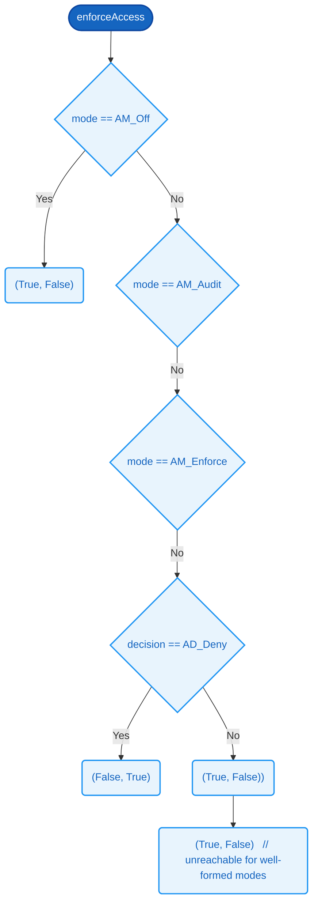

# `enforceAccess`

### Signature

**Parameters**
- `mode`: [AccessMode](../SDEP/types.md#accessmode)
- `decision`: [AccessDecision](../SDEP/types.md#accessdecision)

**Returns**
- (Bit, Bit)

<details><summary>Raw signature</summary>

`AccessMode -> AccessDecision -> (Bit, Bit)`

</details>

Evaluates 6 conditions on `mode` and `decision` in priority order, returning the first applicable a tuple. Defaults to `(True, False)` when no prior condition matches.

| # | Condition | Result |
|---|-----------|--------|
| 1 | mode == [AM_Off](../SDEP/types.md#accessmode) | (True, False) |
| 2 | mode == [AM_Audit](../SDEP/types.md#accessmode) |  |
| 3 | mode == [AM_Enforce](../SDEP/types.md#accessmode) |  |
| 4 | decision == [AD_Deny](../SDEP/types.md#accessdecision) | (False, True) |
| 5 | *(otherwise)* | (True,  False)) |
| 6 | *(otherwise)* | (True, False)   // unreachable for well-formed modes |



### Related Properties
- [P11 — Access Off Allows Without Logging](../SDEP/properties/access-control.md#p11--access-off-allows-without-logging)
- [P12 — Access Audit Never Denies](../SDEP/properties/access-control.md#p12--access-audit-never-denies)
- [P13 — Access Enforce Blocks Denials](../SDEP/properties/access-control.md#p13--access-enforce-blocks-denials)
- [P14 — Access Enforce Allows Permitted](../SDEP/properties/access-control.md#p14--access-enforce-allows-permitted)
- [P26 — Enforce Without Rule Allows Silently](../SDEP/properties/error-handling.md#p26--enforce-without-rule-allows-silently)
- [P27 — Audit Logs Only On Denial](../SDEP/properties/error-handling.md#p27--audit-logs-only-on-denial)

<details><summary>Formal definition (Cryptol)</summary>

```cryptol
enforceAccess mode decision =
  if mode == AM_Off then (True, False)
   | mode == AM_Audit then
        (if decision == AD_Deny then (True, True) else (True, False))
   | mode == AM_Enforce then
        (if decision == AD_Allow  then (True,  False)
          | decision == AD_Deny   then (False, True)
         else                          (True,  False))
  else (True, False)   // unreachable for well-formed modes
```

</details>
