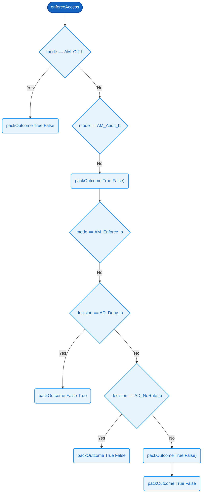

# `enforceAccess`

### Signature

**Parameters**
- `mode`: [8]
- `decision`: [8]

**Returns**
- [16]

<details><summary>Raw signature</summary>

`[8] -> [8] -> [16]`

</details>

### Formal definition (Cryptol)

```haskell
enforceAccess mode decision =
  if mode == AM_Off_b then packOutcome True False
   | mode == AM_Audit_b then
        (if decision == AD_Deny_b then packOutcome True True
         else                          packOutcome True False)
   | mode == AM_Enforce_b then
        (if decision == AD_Allow_b  then packOutcome True  False
          | decision == AD_Deny_b   then packOutcome False True
          | decision == AD_NoRule_b then packOutcome True  False
         else                            packOutcome True  False)
  else                                   packOutcome True  False
```

Evaluates 8 conditions on `mode` and `decision` in priority order, returning the first applicable 16 bits. Defaults to `packOutcome True  False` when no prior condition matches.



### Related Properties
- [P11 — Access Off Allows Without Logging](../properties/access-control.md#p11--access-off-allows-without-logging)
- [P12 — Access Audit Never Denies](../properties/access-control.md#p12--access-audit-never-denies)
- [P13 — Access Enforce Blocks Denials](../properties/access-control.md#p13--access-enforce-blocks-denials)
- [P14 — Access Enforce Allows Permitted](../properties/access-control.md#p14--access-enforce-allows-permitted)
- [P26 — Enforce Without Rule Allows Silently](../properties/enforce-access-matrix-coverage-closures.md#p26--enforce-without-rule-allows-silently)
- [P27 — Audit Logs Only On Denial](../properties/enforce-access-matrix-coverage-closures.md#p27--audit-logs-only-on-denial)
- [P30 — Audit Equals Enforce](../properties/intentional-counterexamples.md#p30--audit-equals-enforce)

