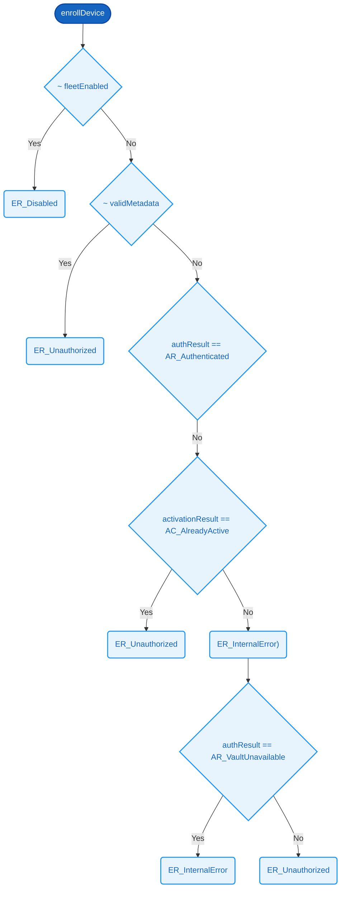

# `enrollDevice`

### Signature

**Parameters**
- `fleetEnabled`: Bit
- `validMetadata`: Bit
- `authResult`: [AuthResult](../SDEP/types.md#authresult)
- `activationResult`: [ActivationResult](../SDEP/types.md#activationresult)

**Returns**
- [EnrollmentResult](../SDEP/types.md#enrollmentresult)

<details><summary>Raw signature</summary>

`Bit -> Bit -> AuthResult -> ActivationResult -> EnrollmentResult`

</details>

Evaluates 7 conditions on `fleetEnabled`, `validMetadata`, `authResult`, and `activationResult` in priority order, returning the first applicable `[EnrollmentResult](../SDEP/types.md#enrollmentresult)`. Defaults to `[ER_Unauthorized](../SDEP/types.md#enrollmentresult)` when no prior condition matches.

| # | Condition | Result |
|---|-----------|--------|
| 1 | ~ fleetEnabled | [ER_Disabled](../SDEP/types.md#enrollmentresult) |
| 2 | ~ validMetadata | [ER_Unauthorized](../SDEP/types.md#enrollmentresult) |
| 3 | authResult == [AR_Authenticated](../SDEP/types.md#authresult) |  |
| 4 | activationResult == [AC_AlreadyActive](../SDEP/types.md#activationresult) | [ER_Unauthorized](../SDEP/types.md#enrollmentresult) |
| 5 | *(otherwise)* | [ER_InternalError](../SDEP/types.md#enrollmentresult)) |
| 6 | authResult == [AR_VaultUnavailable](../SDEP/types.md#authresult) | [ER_InternalError](../SDEP/types.md#enrollmentresult) |
| 7 | *(otherwise)* | [ER_Unauthorized](../SDEP/types.md#enrollmentresult) |



### Related Properties
- [P1 — Active Key Cannot Be Reactivated](../SDEP/properties/key-lifecycle-safety.md#p1--active-key-cannot-be-reactivated)
- [P5 — Disabled Fleet Rejects Everything](../SDEP/properties/key-lifecycle-safety.md#p5--disabled-fleet-rejects-everything)
- [P10 — Missing Metadata Is Unauthorized](../SDEP/properties/authentication-security.md#p10--missing-metadata-is-unauthorized)
- [P16 — Authenticated Enrollment Succeeds](../SDEP/properties/protocol-liveness.md#p16--authenticated-enrollment-succeeds)
- [P19 — Vault Unavailable Is Internal Error](../SDEP/properties/error-handling.md#p19--vault-unavailable-is-internal-error)
- [P21 — Activate Without Metadata Is Unauthorized](../SDEP/properties/error-handling.md#p21--activate-without-metadata-is-unauthorized)
- [P22 — Activation Io Failure Is Internal Error](../SDEP/properties/error-handling.md#p22--activation-io-failure-is-internal-error)

<details><summary>Formal definition (Cryptol)</summary>

```cryptol
enrollDevice fleetEnabled validMetadata authResult activationResult =
  if ~ fleetEnabled                       then ER_Disabled
   | ~ validMetadata                      then ER_Unauthorized
   | authResult == AR_Authenticated       then
        (if activationResult == AC_Success       then ER_Succeeded
          | activationResult == AC_AlreadyActive then ER_Unauthorized
         else                                         ER_InternalError)
   | authResult == AR_VaultUnavailable    then ER_InternalError
  else                                         ER_Unauthorized
```

</details>
