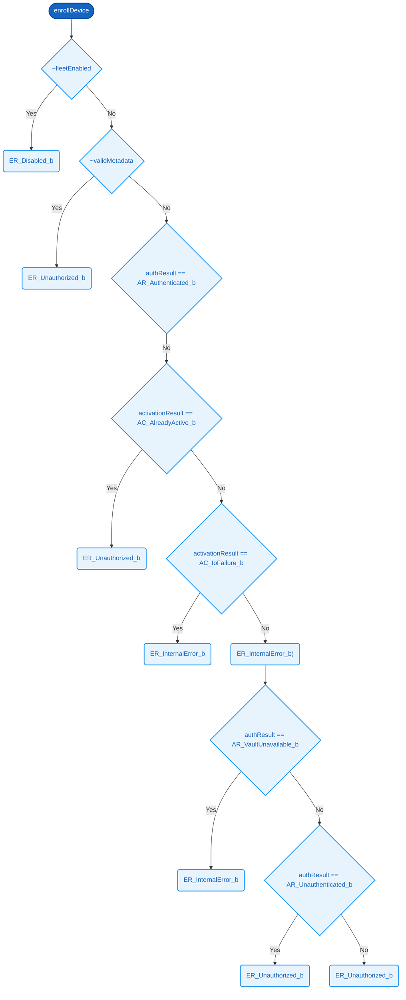

# `enrollDevice`  ✓

### Signature

**Parameters**
- `fleetEnabled`: Bit
- `validMetadata`: Bit
- `authResult`: [8]
- `activationResult`: [8]

**Returns**
- [8]

<details><summary>Raw signature</summary>

`Bit -> Bit -> [8] -> [8] -> [8]`

</details>

### Formal definition (Cryptol)

```haskell
enrollDevice fleetEnabled validMetadata authResult activationResult =
  if ~fleetEnabled         then ER_Disabled_b
   | ~validMetadata        then ER_Unauthorized_b
   | authResult == AR_Authenticated_b   then
        (if activationResult == AC_Success_b       then ER_Succeeded_b
          | activationResult == AC_AlreadyActive_b then ER_Unauthorized_b
          | activationResult == AC_IoFailure_b     then ER_InternalError_b
         else                                           ER_InternalError_b)
   | authResult == AR_VaultUnavailable_b then ER_InternalError_b
   | authResult == AR_Unauthenticated_b  then ER_Unauthorized_b
  else                                         ER_Unauthorized_b
```

The C++ body uses `switch` on AuthResult and ActivationResult.  Any
enum value outside the declared set falls through to the defensive
`return Unauthorized` after the outer switch.  We mirror that here.



### Related Properties
- [P1 — Active Key Cannot Be Reactivated](../properties/key-lifecycle-safety.md#p1--active-key-cannot-be-reactivated)
- [P5 — Disabled Fleet Rejects Everything](../properties/key-lifecycle-safety.md#p5--disabled-fleet-rejects-everything)
- [P10 — Missing Metadata Is Unauthorized](../properties/authentication-security.md#p10--missing-metadata-is-unauthorized)
- [P16 — Authenticated Enrollment Succeeds](../properties/protocol-liveness.md#p16--authenticated-enrollment-succeeds)
- [P19 — Vault Unavailable Is Internal Error](../properties/error-handling.md#p19--vault-unavailable-is-internal-error)
- [P21 — Activate Without Metadata Is Unauthorized](../properties/error-handling.md#p21--activate-without-metadata-is-unauthorized)
- [P22 — Activation Io Failure Is Internal Error](../properties/error-handling.md#p22--activation-io-failure-is-internal-error)
- [P32 — Authenticated Implies Enrolled](../properties/intentional-counterexamples.md#p32--authenticated-implies-enrolled)

