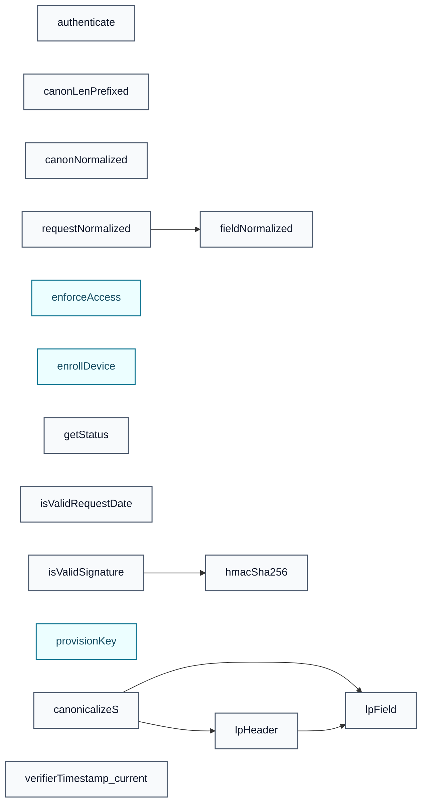

# Functions

| Function | Description |
|----------|-------------|
| [provisionKey](provisionKey.md) | Evaluates 5 conditions on `fleetEnabled`, `validRequest`, `vaultResult`, and `keyIsActive` in priority order, returning the first applicable `ProvisionResult`. Defaults to `PR_Succeeded` when no prior condition matches. |
| [enrollDevice](enrollDevice.md) | Evaluates 7 conditions on `fleetEnabled`, `validMetadata`, `authResult`, and `activationResult` in priority order, returning the first applicable `EnrollmentResult`. Defaults to `ER_Unauthorized` when no prior condition matches. |
| [authenticate](authenticate.md) | Returns `True` only when all of `dateValid`, `signatureValid`, and `claimsValid` are true. |
| [isValidRequestDate](isValidRequestDate.md) | Checks whether the request date is valid: validates a bounded condition over `requestTs`, `currentTime`, and `windowSeconds`. |
| [hmacSha256](hmacSha256.md) | Uninterpreted in proofs (SAW can treat this as a Cryptol primitive). |
| [isValidSignature](isValidSignature.md) | Checks whether the signature is valid by comparing the computed and expected values. |
| [enforceAccess](enforceAccess.md) | Evaluates 6 conditions on `mode` and `decision` in priority order, returning the first applicable a tuple. Defaults to `(True, False)` when no prior condition matches. |
| [getStatus](getStatus.md) | Constructs `EnrollmentStatus` from the given inputs. |
| [canonNormalized](canonNormalized.md) | A field is normalized iff bytes at indices >= n are zero. This is the invariant the C++ / Rust code maintains implicitly (it only reads the first n bytes); making it explicit keeps logically-distinct requests distinct as Cryptol values, so any collision the solver finds is a *real* one. |
| [canonLenPrefixed](canonLenPrefixed.md) | Length-prefixed canonicalization. Each variable-length field is preceded by its length tag: a parser reads the tag, then exactly that many bytes, then the next tag, then exactly that many bytes. No byte inside any field can be misread as a boundary, so the encoding is structurally injective. |
| [fieldNormalized](fieldNormalized.md) | Compares computed and provided values over `f`, returning `True` on match. |
| [requestNormalized](requestNormalized.md) | Tests whether `r` is well-formed. |
| [lpField](lpField.md) | Length-prefix a Field as [len-byte] # buf. |
| [lpHeader](lpHeader.md) | Length-prefix a header pair OR emit a constant-size all-zero placeholder if it is the auth header. Fixed output size keeps canonicalizeS Cryptol- statable; the placeholder content is irrelevant because the encoder elides auth headers regardless of their value. |
| [canonicalizeS](canonicalizeS.md) | Concrete canonicalize: length-prefixed method, body, headers (with auth-header exclusion), path, then the 8-byte big-endian timestamp. |
| [verifierTimestamp_current](verifierTimestamp_current.md) | The timestamp the verifier validates must equal the timestamp inside the signed request — otherwise an attacker can replay a stale signed request with a fresh "current time" supplied by the caller and pass the freshness check despite the signature being over old bytes. |

### Call Graph

**Key:** 🔵 function · 🟢 decision

