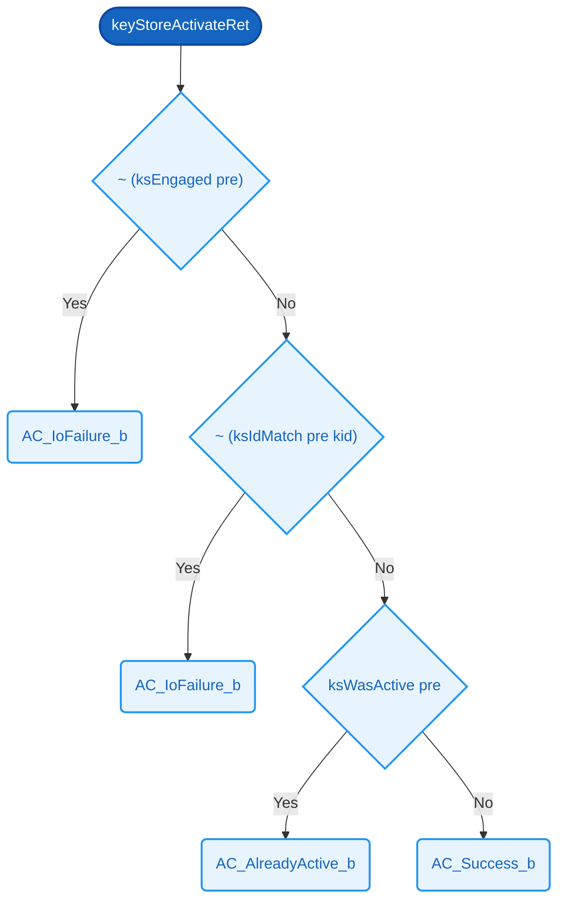

# `keyStoreActivateRet`  📄

> 📄 **Spec-only.** This definition lives in the Cryptol model on purpose — typically as a gap-exhibiting reference function — and has **no production implementation**.

### Signature

**Parameters**
- `pre`: [[KS_BYTES](../types.md#ks_bytes)][8]
- `kid`: [16][8]

**Returns**
- [8]

<details><summary>Raw signature</summary>

`[KS_BYTES][8] -> [16][8] -> [8]`

</details>

### Formal definition (Cryptol)

```haskell
keyStoreActivateRet pre kid =
  if ~ (ksEngaged pre)      then AC_IoFailure_b
   | ~ (ksIdMatch pre kid)  then AC_IoFailure_b
   | ksWasActive pre        then AC_AlreadyActive_b
  else                           AC_Success_b
```

> **Not yet verified.**

Returned ActivationResult byte — structurally identical to the C++
branch ladder, same branch order.



### Related Properties
- [KS2 — Success Implies Active](../properties/prove).md#ks2--success-implies-active)
- [KS4 — Io Failure No Effect](../properties/prove).md#ks4--io-failure-no-effect)

