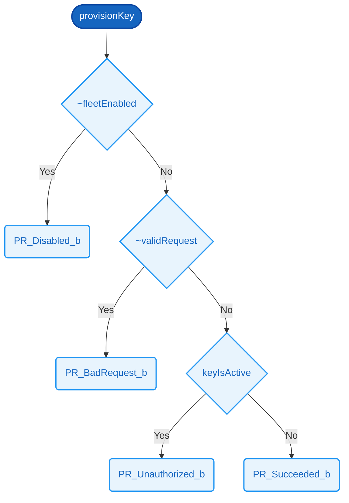

# `provisionKey`  ✅

### Signature

**Parameters**
- `fleetEnabled`: Bit
- `validRequest`: Bit
- `vaultResult`: [8]
- `keyIsActive`: Bit

**Returns**
- [8]

<details><summary>Raw signature</summary>

`Bit -> Bit -> [8] -> Bit -> [8]`

</details>

### Formal definition (Cryptol)

```haskell
provisionKey fleetEnabled validRequest vaultResult keyIsActive =
  if ~fleetEnabled         then PR_Disabled_b
   | ~validRequest         then PR_BadRequest_b
   | vaultResult != KV_Ok_b
                           then PR_InternalError_b
   | keyIsActive           then PR_Unauthorized_b
  else                          PR_Succeeded_b
```

C++ body:

```text
  if (!fleetEnabled)                  return Disabled;
  if (!validRequest)                  return BadRequest;
  if (vaultResult != KeyVaultResult::Ok)
                                      return InternalError;
  if (keyIsActive)                    return Unauthorized;
  return Succeeded;
```

This handles ALL 256 possible i8 values of vaultResult uniformly:
anything that is not KV_Ok (0) is treated as InternalError, exactly
matching the C++ `!=` check.  No precondition is needed.



### Related Properties
- [P2 — Active Key Blocks Provisioning](../properties/key-lifecycle-safety.md#p2--active-key-blocks-provisioning)
- [P5 — Disabled Fleet Rejects Everything](../properties/key-lifecycle-safety.md#p5--disabled-fleet-rejects-everything)
- [P15 — Authorized Request On Inactive Key Succeeds](../properties/protocol-liveness.md#p15--authorized-request-on-inactive-key-succeeds)
- [P20 — Invalid Request Is Bad Request](../properties/error-handling.md#p20--invalid-request-is-bad-request)

