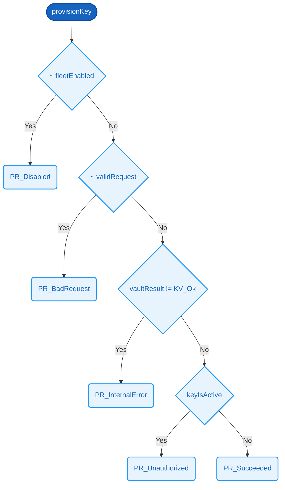

# `provisionKey`

### Signature

**Parameters**
- `fleetEnabled`: Bit
- `validRequest`: Bit
- `vaultResult`: [KeyVaultResult](../SDEP/types.md#keyvaultresult)
- `keyIsActive`: Bit

**Returns**
- [ProvisionResult](../SDEP/types.md#provisionresult)

<details><summary>Raw signature</summary>

`Bit -> Bit -> KeyVaultResult -> Bit -> ProvisionResult`

</details>

Evaluates 5 conditions on `fleetEnabled`, `validRequest`, `vaultResult`, and `keyIsActive` in priority order, returning the first applicable `[ProvisionResult](../SDEP/types.md#provisionresult)`. Defaults to `[PR_Succeeded](../SDEP/types.md#provisionresult)` when no prior condition matches.

| # | Condition | Result |
|---|-----------|--------|
| 1 | ~ fleetEnabled | [PR_Disabled](../SDEP/types.md#provisionresult) |
| 2 | ~ validRequest | [PR_BadRequest](../SDEP/types.md#provisionresult) |
| 3 | vaultResult != [KV_Ok](../SDEP/types.md#keyvaultresult) | [PR_InternalError](../SDEP/types.md#provisionresult) |
| 4 | keyIsActive | [PR_Unauthorized](../SDEP/types.md#provisionresult) |
| 5 | *(otherwise)* | [PR_Succeeded](../SDEP/types.md#provisionresult) |



### Related Properties
- [P2 — Active Key Blocks Provisioning](../SDEP/properties/key-lifecycle-safety.md#p2--active-key-blocks-provisioning)
- [P5 — Disabled Fleet Rejects Everything](../SDEP/properties/key-lifecycle-safety.md#p5--disabled-fleet-rejects-everything)
- [P15 — Authorized Request On Inactive Key Succeeds](../SDEP/properties/protocol-liveness.md#p15--authorized-request-on-inactive-key-succeeds)
- [P20 — Invalid Request Is Bad Request](../SDEP/properties/error-handling.md#p20--invalid-request-is-bad-request)

<details><summary>Formal definition (Cryptol)</summary>

```cryptol
provisionKey fleetEnabled validRequest vaultResult keyIsActive =
  if ~ fleetEnabled        then PR_Disabled
   | ~ validRequest        then PR_BadRequest
   | vaultResult != KV_Ok  then PR_InternalError
   | keyIsActive           then PR_Unauthorized
  else                          PR_Succeeded
```

</details>
