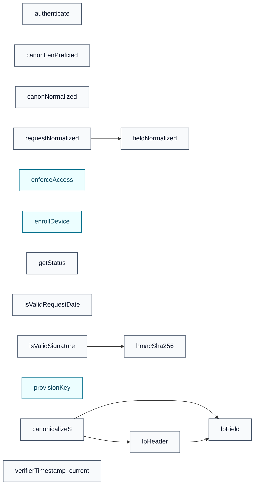

# SDEP Cryptol Spec

## Types

All type definitions: [types.md](types.md)

## Functions

All function definitions: [functions](functions/index.md)

### Call Graph

**Key:** 🔵 function · 🟢 decision

## Security Properties

| Category | Properties |
|----------|------------|
| [Key Lifecycle Safety](properties/key-lifecycle-safety.md) | P1–P5 |
| [Authentication Security](properties/authentication-security.md) | P6–P10 |
| [Access Control](properties/access-control.md) | P11–P14 |
| [Protocol Liveness](properties/protocol-liveness.md) | P15–P18 |
| [Error Handling](properties/error-handling.md) | P19–P27 |
| [Auth-header exclusion](properties/auth-header-exclusion.md) | P28 |
| [Timestamp binding](properties/timestamp-binding.md) | P29 |

