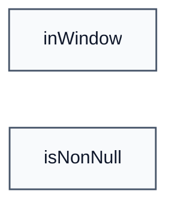

# Functions

| Function | Description |
|----------|-------------|
| [inWindow](inWindow.md) | For bug #12: 3x std::int64_t typed parameters. |
| [isNonNull](isNonNull.md) | For bug #11: void* in C++; model as a 64-bit address on the Cryptol side. |

### Call Graph

