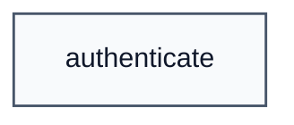

# SDEP_min

## Types

All type definitions: [types.md](types.md)

## Functions

All function definitions: [functions](functions/index.md)

### Call Graph

## Security Properties

| Category | Properties |
|----------|------------|
| [Miscellaneous](properties/misc.md) | P |

